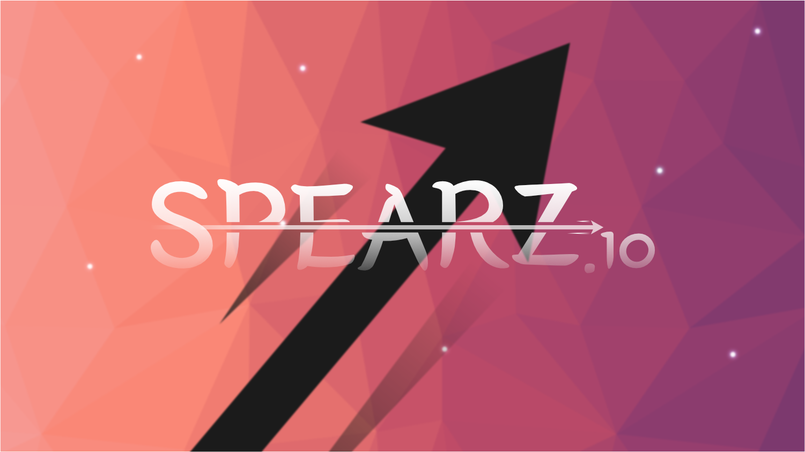

Spearz&#46;io was a simple web game and my first complete public project. :)

Developing spearz was an amazing and challenging experience. Multiplayer networking was an especially tricky set of concepts to learn and implement. After releasing the game and having some fun promoting it, I've decided to make it open source in the hope that it will serve as a useful resource to anyone looking to develop their own web game. The game is no longer available online, but you can clone and run this project and use something like [ngrok](https://ngrok.com/) to temporarily host it. It's incredibly useful to have a complete example of what goes in to a project like this and certainly a resource I wish I had access to while developing it.

While learning multiplayer concepts, I found the [documentation on Valve's Source Engine](https://developer.valvesoftware.com/wiki/Source_Multiplayer_Networking) and [Gabriel Gambetta's series on Fast-Paced Multiplayer](http://www.gabrielgambetta.com/client-server-game-architecture.html) especially helpful.

Dig around! I hope you find something useful 😉👨🏽‍💻
